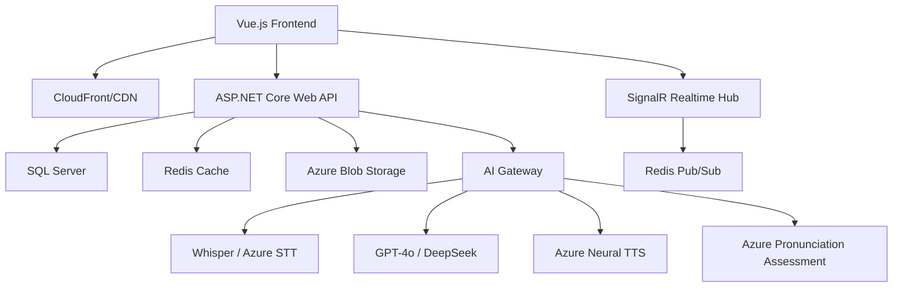
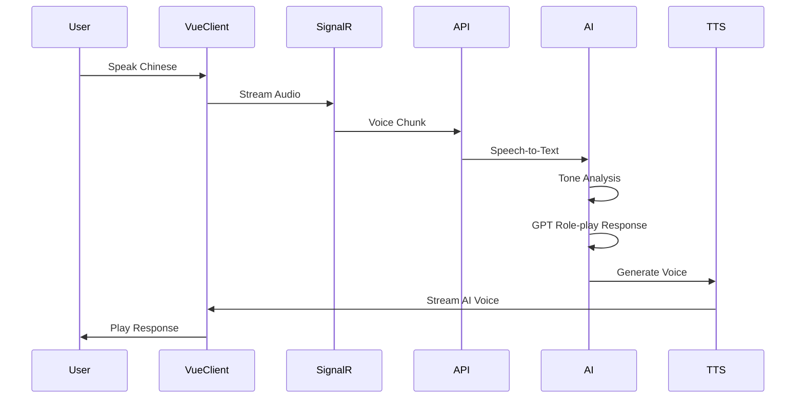
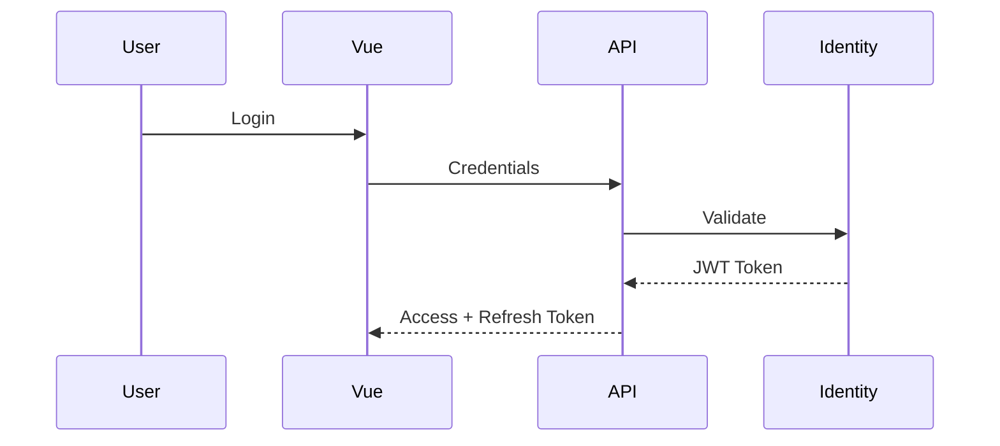

# README.md — LingoTone AI Pro

> AI-first Chinese Learning Platform inspired by Duolingo + Elsa Speak + ChatGPT Voice

---

# 🧠 LingoTone AI Pro

LingoTone AI Pro là nền tảng học tiếng Trung thế hệ mới tích hợp AI realtime, tập trung vào:

* 🎙️ Luyện phát âm thanh điệu tiếng Trung bằng AI
* 🤖 Hội thoại realtime với AI Role-play
* 📈 Cá nhân hóa lộ trình học theo HSK
* 🧠 AI ghi nhớ lỗi sai của người học
* 🌊 Phân tích waveform + tone contour trực quan
* ⚡ Trải nghiệm immersive như native app

Hệ thống được thiết kế theo phong cách:

* Duolingo (gamification)
* Elsa Speak (AI pronunciation)
* ChatGPT Voice (voice interaction)
* HiHSK / SuperChinese (Chinese learning UX)

---

# 🚀 Demo Highlights

## ✨ AI-first Immersive Experience

### 🎤 AI Voice Conversation

* AI avatar realtime
* Voice waveform animation
* Streaming AI response
* AI emotion switching
* AI listening/thinking states

### 🧠 Pronunciation Intelligence

* Tone contour visualization
* Native vs User overlay graph
* Realtime pronunciation scoring
* AI coach feedback
* Tone accuracy analytics

### 📚 Smart Learning System

* AI remembers weak tones
* Dynamic lesson recommendation
* Personalized HSK progression
* Smart vocabulary review
* Daily AI missions

### 🌌 Premium UX/UI

* Glassmorphism UI
* Animated particles
* Floating Hanzi background
* Neon dark mode
* Mobile-native experience

---

# 🏗️ SYSTEM ARCHITECTURE

## Overall Architecture



---

# 🧩 Clean Architecture Design

```text
Presentation Layer
 ├── Web API
 ├── SignalR Hub
 └── Vue.js Frontend

Application Layer
 ├── CQRS
 ├── Use Cases
 ├── DTOs
 └── AI Orchestrator

Domain Layer
 ├── Entities
 ├── Interfaces
 ├── Value Objects
 └── Business Rules

Infrastructure Layer
 ├── EF Core
 ├── Redis
 ├── Azure Services
 ├── AI Providers
 └── Blob Storage
```

---

# 🧠 AI PIPELINE

## Voice Conversation Flow



---

# 🎯 CORE FEATURES

# 1. HOME PAGE

## Features

* Animated AI Hero Section
* Floating Hanzi background
* AI speaking preview
* Live waveform
* AI tutor introduction
* Scenario cards
* AI mission system

## UX Goals

* Tạo cảm giác “AI đang sống”
* Gây ấn tượng mạnh ngay khi mở app
* Startup-level first impression

---

# 2. AI CHAT SYSTEM

## Realtime AI Role-play

### AI Roles

* 👨‍🏫 Giáo viên
* ✈️ Nhân viên sân bay
* 🍜 Nhà hàng
* 🛍️ Người bán hàng
* 👥 Bạn bè
* 💼 Văn phòng

## AI Capabilities

### Context Memory

AI nhớ:

* Tone user hay sai
* Từ vựng user yếu
* Tốc độ nói
* Trình độ HSK
* Conversation history

### Dynamic Difficulty

Nếu user:

* nói chậm → AI nói chậm
* sai nhiều → AI đơn giản hóa
* tiến bộ → AI tăng độ khó

## Speaking HUD

Realtime metrics:

* Tone Accuracy
* Fluency
* Speed
* Confidence

---

# 3. PRONUNCIATION STUDIO

## Tone Analysis

### Supported Analysis

| Metric        | Description             |
| ------------- | ----------------------- |
| Tone Accuracy | Độ chính xác thanh điệu |
| Fluency       | Độ trôi chảy            |
| Rhythm        | Nhịp điệu               |
| Pronunciation | Phát âm chuẩn           |
| Speed         | Tốc độ nói              |

---

## Tone Visualization

### Features

* Waveform animation
* Tone contour graph
* Native vs User overlay
* Color-coded feedback
* Radar chart analytics

---

## AI Coach Feedback

Ví dụ:

```text
❌ "Má" chưa lên đủ cao.
Hãy kéo giọng từ trung bình lên cao hơn ở cuối câu.
```

---

# 4. DASHBOARD ANALYTICS

## Dashboard Metrics

### User Progress

* XP system
* Streak tracking
* Weekly learning time
* Speaking score
* HSK progression

### AI Insights

* Tone improvement analytics
* Personalized recommendations
* Weakness detection
* Smart lesson suggestion

---

# 5. VOCABULARY SYSTEM

## Features

* Swipe flashcards
* Audio pronunciation
* HSK tagging
* Bookmarking
* Smart spaced repetition

## Vocabulary Topics

* Airport
* Restaurant
* Shopping
* Hotel
* Dating
* Office
* Daily conversation

---

# 6. LESSON SYSTEM

## Lesson Types

* Reading
* Listening
* Speaking
* Drag & Drop
* Quiz
* AI explanation

## AI-Assisted Learning

AI sẽ:

* giải thích từ khó
* phân tích ngữ pháp
* tạo ví dụ mới
* điều chỉnh bài học theo user

---

# 🌙 DARK MODE SYSTEM

## Design Language

### Light Theme

| Element    | Color   |
| ---------- | ------- |
| Primary    | #4CD964 |
| Accent     | #FF9500 |
| Background | #F8FAFC |

### Dark Theme

| Element    | Color   |
| ---------- | ------- |
| Background | #0F172A |
| Card       | #1E293B |
| Border     | #334155 |
| Text       | #E2E8F0 |

---

# 📱 MOBILE EXPERIENCE

## Mobile-first Features

* Sticky mic button
* Bottom navigation
* Gesture UI
* Fullscreen speaking mode
* Native-app feeling

---

# 🗃️ DATABASE DESIGN

## Main Tables

### Users

```sql
Users
- Id
- Email
- PasswordHash
- FullName
- AvatarUrl
- CurrentHSKLevel
- XP
- StreakDays
- LastActiveDate
```

### AIConversationSessions

```sql
AIConversationSessions
- Id
- UserId
- Role
- HSKLevel
- StartedAt
```

### PronunciationPracticeHistory

```sql
PronunciationPracticeHistory
- Id
- UserId
- OriginalText
- UserAudioUrl
- AccuracyScore
- ToneScore
- FluencyScore
- FeedbackJson
```

---

# 🔌 API DESIGN

# REST API

## Authentication

```http
POST /api/auth/register
POST /api/auth/login
```

## Vocabulary

```http
GET /api/vocab?hsk=2
POST /api/vocab/{id}/bookmark
```

## Pronunciation

```http
POST /api/pronunciation/assess
```

## AI Chat

```http
POST /api/ai/session/create
GET /api/ai/session/{id}/history
```

---

# ⚡ SIGNALR REALTIME EVENTS

## ChatHub

```csharp
SendVoiceChunk()
ReceiveAIResponse()
ReceiveTranscript()
ReceiveTypingAnimation()
```

## PronunciationHub

```csharp
SendAudioStream()
ReceiveWaveformData()
ReceiveScoreUpdate()
```

---

# 📂 PROJECT STRUCTURE

```text
LingoTone/
├── backend/
│   ├── Domain/
│   ├── Application/
│   ├── Infrastructure/
│   └── WebAPI/
│
├── frontend/
│   ├── components/
│   ├── composables/
│   ├── views/
│   ├── stores/
│   └── assets/
│
├── docs/
├── ai-prompts/
└── README.md
```

---

# 🧠 AI MODELS & SERVICES

| Task                     | Technology                       |
| ------------------------ | -------------------------------- |
| STT                      | Whisper V3 / Azure STT           |
| TTS                      | Azure Neural TTS                 |
| LLM                      | GPT-4o / DeepSeek                |
| Pronunciation Assessment | Azure Cognitive Services         |
| Recommendation Engine    | ML.NET / Collaborative Filtering |
| Realtime Communication   | SignalR                          |
| Cache                    | Redis                            |

---

# 🔒 AUTHENTICATION FLOW



---

# 📈 SCALING STRATEGY

## Backend Scaling

* Horizontal scaling
* Redis backplane
* AI worker services
* Rate limiting

## CDN Strategy

* Audio caching
* Avatar caching
* Static asset optimization

---

# 🎮 GAMIFICATION SYSTEM

## Features

* XP
* Daily streak
* Leaderboard
* Achievement badges
* AI missions
* Unlockable content

---

# 🧪 FUTURE ROADMAP

# Phase 1 — MVP

* Auth
* Vocabulary
* Flashcard
* Quiz
* Dashboard

# Phase 2 — AI Core

* Realtime STT/TTS
* Pronunciation Assessment
* SignalR AI Chat

# Phase 3 — Advanced AI

* AI Memory
* Smart recommendation
* Dynamic role-play
* Adaptive difficulty

# Phase 4 — Expansion

* Mobile app
* WebRTC AI Call
* Multiplayer practice
* AI teacher dashboard

---

# 👨‍💻 TEAM RESPONSIBILITIES

# 👤 Member 1 — Frontend & UI/UX Engineer

## Responsibilities

* Vue.js UI
* TailwindCSS
* Dark mode
* Animations
* Responsive design
* Mobile UX
* Glassmorphism effects

## Main Modules

* Home page
* Dashboard
* Vocabulary UI
* Navigation system
* Theme system

---

# 👤 Member 2 — AI & Realtime Engineer

## Responsibilities

* SignalR
* Voice streaming
* AI orchestration
* GPT integration
* STT/TTS pipeline
* Pronunciation analysis

## Main Modules

* AI Chat
* Realtime voice
* AI Coach
* Waveform system
* AI memory

---

# 👤 Member 3 — Backend & Database Engineer

## Responsibilities

* ASP.NET Core API
* SQL Server
* Entity Framework
* Redis cache
* Authentication
* CQRS architecture

## Main Modules

* REST API
* Database
* User system
* Progress tracking
* AI session persistence

---

# 👤 Member 4 — DevOps & QA Engineer

## Responsibilities

* CI/CD
* Azure deployment
* Docker
* Performance testing
* Security
* Monitoring

## Main Modules

* Deployment pipeline
* Load testing
* Logging
* Error tracking
* API monitoring

---

# 🏆 WHY THIS PROJECT STANDS OUT

## Technical Strength

✅ Clean Architecture
✅ Realtime AI System
✅ Enterprise-grade backend
✅ AI Voice Pipeline
✅ Scalable infrastructure

## Product Strength

✅ AI-first UX
✅ Personalized learning
✅ Chinese tone analysis
✅ Startup-level design
✅ Mobile immersive experience

## Academic Strength

✅ Applied AI
✅ Speech processing
✅ Recommendation system
✅ Realtime architecture
✅ Human-computer interaction

---

# 🧡 Inspiration

Inspired by:

* Duolingo
* ELSA Speak
* OpenAI
* Hi HSK

---

# 📌 Final Vision

> “LingoTone AI không chỉ là website học tiếng Trung.
> Đây là AI speaking companion giúp người Việt tự tin giao tiếp tiếng Trung bằng công nghệ AI realtime.”
