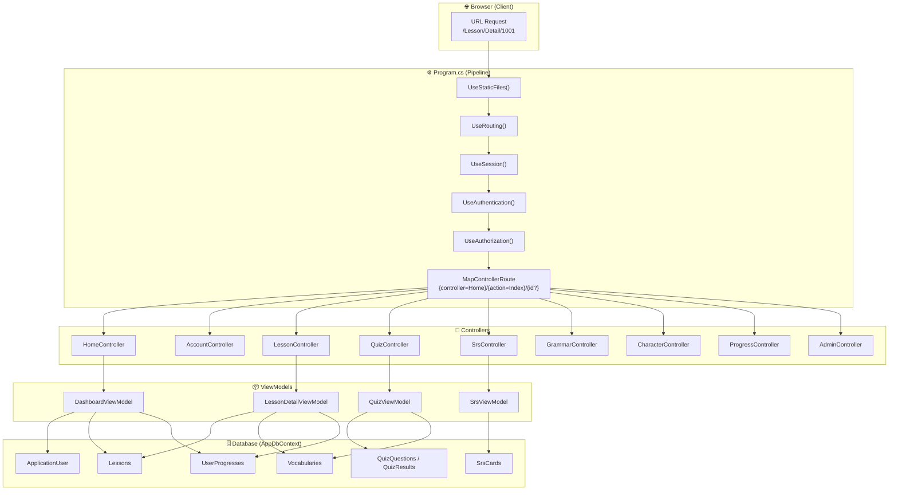
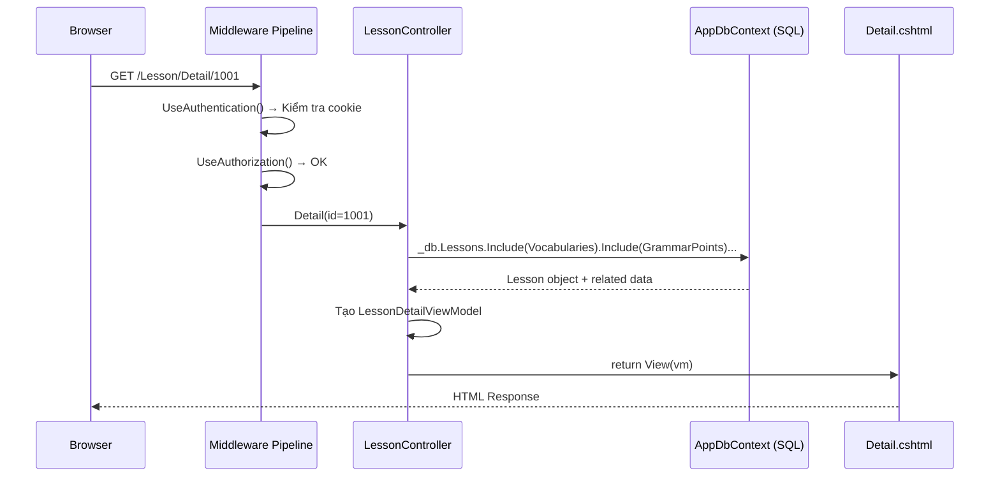
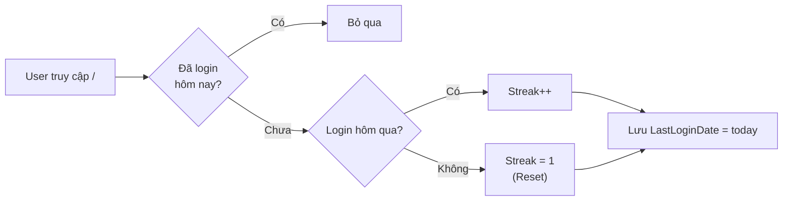
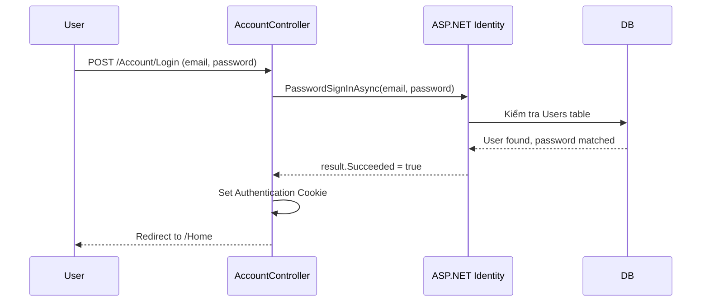
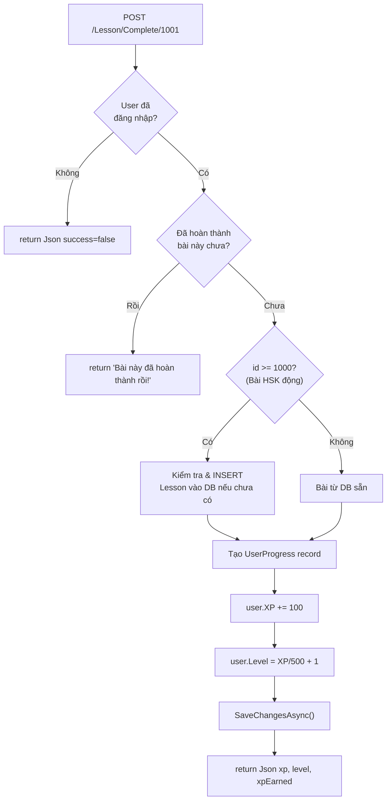
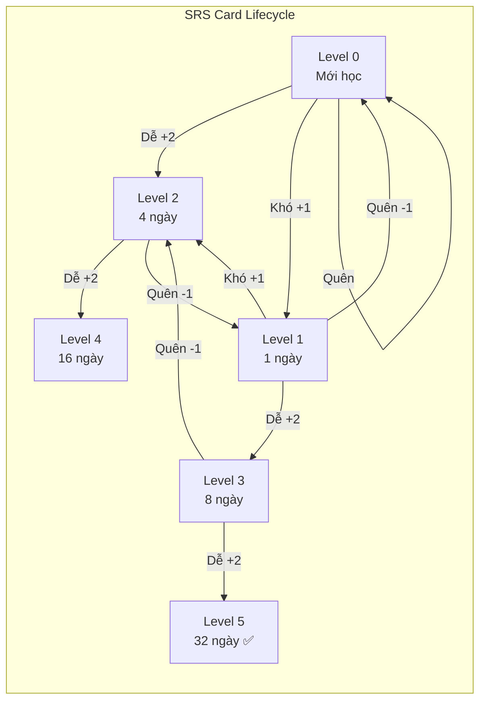
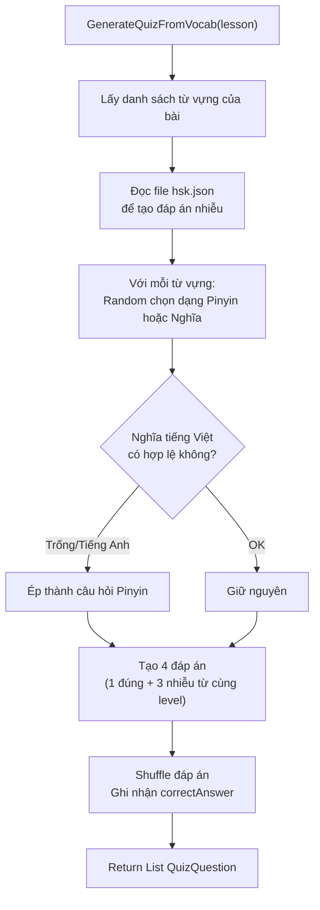
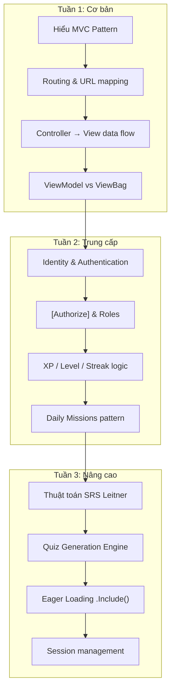

# 📘 PHÂN TÍCH MẢNG 2: BACKEND LOGIC & MVC ROUTING

## Dự án: LingoTone AI — Website học tiếng Trung thông minh

---

## 📐 KIẾN TRÚC TỔNG QUAN



---

## 🗺️ TOÀN BỘ CÁC FILE BẠN CẦN NGHIÊN CỨU

| # | File | Vai trò | Độ khó |
|---|------|---------|--------|
| 1 | [Program.cs](file:///c:/taitailieu/NopBai/LTW/DoAnMonHoc_LapTrinhWeb_404Team/Program.cs) | Cấu hình toàn bộ ứng dụng | ⭐ Basic |
| 2 | [HomeController.cs](file:///c:/taitailieu/NopBai/LTW/DoAnMonHoc_LapTrinhWeb_404Team/Controllers/HomeController.cs) | Dashboard + Streak + Daily Missions | ⭐⭐ Intermediate |
| 3 | [AccountController.cs](file:///c:/taitailieu/NopBai/LTW/DoAnMonHoc_LapTrinhWeb_404Team/Controllers/AccountController.cs) | Đăng ký/Đăng nhập/Đăng xuất | ⭐ Basic |
| 4 | [LessonController.cs](file:///c:/taitailieu/NopBai/LTW/DoAnMonHoc_LapTrinhWeb_404Team/Controllers/LessonController.cs) | Danh sách bài học + Chi tiết + Hoàn thành | ⭐⭐ Intermediate |
| 5 | [QuizController.cs](file:///c:/taitailieu/NopBai/LTW/DoAnMonHoc_LapTrinhWeb_404Team/Controllers/QuizController.cs) | Sinh quiz + Chấm bài + Leaderboard | ⭐⭐⭐ Advanced |
| 6 | [SrsController.cs](file:///c:/taitailieu/NopBai/LTW/DoAnMonHoc_LapTrinhWeb_404Team/Controllers/SrsController.cs) | Thuật toán ôn tập Leitner SRS | ⭐⭐⭐ Advanced |
| 7 | [GrammarController.cs](file:///c:/taitailieu/NopBai/LTW/DoAnMonHoc_LapTrinhWeb_404Team/Controllers/GrammarController.cs) | Ngữ pháp + AI kiểm tra | ⭐⭐ Intermediate |
| 8 | [CharacterController.cs](file:///c:/taitailieu/NopBai/LTW/DoAnMonHoc_LapTrinhWeb_404Team/Controllers/CharacterController.cs) | Từ điển Hán tự + Phân trang | ⭐⭐ Intermediate |
| 9 | [ProgressController.cs](file:///c:/taitailieu/NopBai/LTW/DoAnMonHoc_LapTrinhWeb_404Team/Controllers/ProgressController.cs) | Tiến độ học tập | ⭐ Basic |
| 10 | [AdminController.cs](file:///c:/taitailieu/NopBai/LTW/DoAnMonHoc_LapTrinhWeb_404Team/Controllers/AdminController.cs) | Quản trị hệ thống | ⭐⭐ Intermediate |
| 11 | [ApplicationUser.cs](file:///c:/taitailieu/NopBai/LTW/DoAnMonHoc_LapTrinhWeb_404Team/Models/ApplicationUser.cs) | Model người dùng mở rộng | ⭐ Basic |
| 12 | [ViewModels/](file:///c:/taitailieu/NopBai/LTW/DoAnMonHoc_LapTrinhWeb_404Team/ViewModels) | Tất cả ViewModel | ⭐ Basic |

---

## 🟢 PHẦN 1: CƠ BẢN (BASIC) — Routing & Luồng MVC

### 1.1 Routing hoạt động như thế nào?

> [!IMPORTANT]
> Đây là kiến thức NỀN TẢNG quan trọng nhất. Nếu bạn hiểu được luồng này, bạn sẽ hiểu được toàn bộ project.

**Cấu hình routing** nằm ở [Program.cs:78-80](file:///c:/taitailieu/NopBai/LTW/DoAnMonHoc_LapTrinhWeb_404Team/Program.cs#L78-L80):

```csharp
app.MapControllerRoute(
    name: "default",
    pattern: "{controller=Home}/{action=Index}/{id?}");
```

**Cách đọc pattern này:**
- `{controller=Home}` → Tên Controller (mặc định là `Home`)
- `{action=Index}` → Tên phương thức Action (mặc định là `Index`)
- `{id?}` → Tham số tùy chọn

**Bảng ánh xạ URL → Controller → Action trong dự án:**

| URL trên trình duyệt | Controller | Action | Ghi chú |
|----------------------|------------|--------|---------|
| `/` hoặc `/Home` | `HomeController` | `Index()` | Trang Dashboard |
| `/Account/Login` | `AccountController` | `Login()` | Đăng nhập |
| `/Account/Register` | `AccountController` | `Register()` | Đăng ký |
| `/Lesson` | `LessonController` | `Index()` | Danh sách khóa học |
| `/Lesson/Detail/1001` | `LessonController` | `Detail(id=1001)` | Chi tiết bài học |
| `/Lesson/Complete/1001` | `LessonController` | `Complete(id=1001)` | Hoàn thành bài (POST) |
| `/Quiz?lessonId=1001` | `QuizController` | `Index(lessonId=1001)` | Làm quiz |
| `/Quiz` | `QuizController` | `Index(lessonId=null)` | Trang Quiz Arena |
| `/Srs` | `SrsController` | `Index()` | Ôn tập SRS |
| `/Grammar` | `GrammarController` | `Index()` | Ngữ pháp |
| `/Character` | `CharacterController` | `Index()` | Từ điển Hán tự |
| `/Progress` | `ProgressController` | `Index()` | Tiến độ học |
| `/Hsk` | `HskController` | `Index()` | HSK Estimator |
| `/Admin` | `AdminController` | `Index()` | Quản trị (Admin) |

### 1.2 Luồng xử lý MVC — Ví dụ thực tế

Khi user truy cập `/Lesson/Detail/1001`, đây là những gì xảy ra:



### 1.3 Dependency Injection (DI) — Cách Controller nhận dữ liệu

> [!NOTE]
> Mọi Controller đều nhận các service thông qua **Constructor Injection**. Đây là cách ASP.NET Core tự động "tiêm" các đối tượng vào Controller.

Ví dụ ở [LessonController.cs:35-40](file:///c:/taitailieu/NopBai/LTW/DoAnMonHoc_LapTrinhWeb_404Team/Controllers/LessonController.cs#L35-L40):

```csharp
public LessonController(
    AppDbContext db,                              // ← Truy vấn Database
    UserManager<ApplicationUser> userManager,     // ← Quản lý user (Identity)
    HskLessonService hskLessonService             // ← Service đọc dữ liệu HSK
)
{
    _db = db;                    // Lưu vào biến private để dùng trong toàn Controller
    _userManager = userManager;
    _hskLessonService = hskLessonService;
}
```

**Các service được đăng ký** ở [Program.cs:10-57](file:///c:/taitailieu/NopBai/LTW/DoAnMonHoc_LapTrinhWeb_404Team/Program.cs#L10-L57):

```csharp
// Database: AddDbContext → Khi Controller yêu cầu AppDbContext, DI tự tạo
builder.Services.AddDbContext<AppDbContext>(options =>
    options.UseSqlServer(...));

// Identity: UserManager, SignInManager → DI tự tạo
builder.Services.AddIdentity<ApplicationUser, IdentityRole>(...);

// Custom Services
builder.Services.AddTransient<DataSeeder>();        // Transient = tạo mới mỗi lần gọi
builder.Services.AddScoped<HskLessonService>();     // Scoped = 1 instance / 1 request
builder.Services.AddHttpClient<IAiService, GeminiAiService>(); // HTTP + DI
```

### 1.4 Cách truyền dữ liệu từ Controller → View

Dự án sử dụng **3 cách** để truyền dữ liệu:

#### Cách 1: ViewModel (Khuyến nghị ✅)
```csharp
// Trong HomeController.cs:128-142
var vm = new DashboardViewModel
{
    DisplayName = user.DisplayName,
    XP = user.XP,
    Level = user.Level,
    Streak = user.Streak,
    DailyMissions = missions
};
return View("Dashboard", vm);  // ← View nhận data qua @Model
```

#### Cách 2: ViewBag (Dùng cho dữ liệu phụ)
```csharp
// Trong LessonController.cs:226-232
ViewBag.UserDisplayName = user.DisplayName;  // ← Dynamic property
ViewBag.UserXP = user.XP;
ViewBag.UserLevel = user.Level;
// Trong View: @ViewBag.UserXP
```

#### Cách 3: JSON Response (Cho AJAX/API)
```csharp
// Trong LessonController.cs:220
return Json(new { success = true, xp = user.XP, level = user.Level, xpEarned = 100 });
```

---

## 🟡 PHẦN 2: TRUNG CẤP (INTERMEDIATE) — Logic Nghiệp Vụ

### 2.1 Hệ thống XP & Level

> [!TIP]
> Công thức tính Level cực kỳ đơn giản: `Level = (XP / 500) + 1`. Nghĩa là cứ 500 XP thì lên 1 level.

**Các nguồn nhận XP trong dự án:**

| Hành động | XP nhận | File xử lý |
|-----------|---------|-------------|
| Hoàn thành bài học | +100 XP | [LessonController.cs:215](file:///c:/taitailieu/NopBai/LTW/DoAnMonHoc_LapTrinhWeb_404Team/Controllers/LessonController.cs#L215) |
| Trả lời quiz đúng | +20 XP/câu | [QuizController.cs:443](file:///c:/taitailieu/NopBai/LTW/DoAnMonHoc_LapTrinhWeb_404Team/Controllers/QuizController.cs#L443) |
| Combo quiz (>2 câu liên tiếp) | +5 XP bonus | [QuizController.cs:443](file:///c:/taitailieu/NopBai/LTW/DoAnMonHoc_LapTrinhWeb_404Team/Controllers/QuizController.cs#L443) |
| Ôn SRS (Dễ) | +15 XP | [SrsController.cs:64](file:///c:/taitailieu/NopBai/LTW/DoAnMonHoc_LapTrinhWeb_404Team/Controllers/SrsController.cs#L64) |
| Ôn SRS (Khó) | +10 XP | [SrsController.cs:70](file:///c:/taitailieu/NopBai/LTW/DoAnMonHoc_LapTrinhWeb_404Team/Controllers/SrsController.cs#L70) |
| Ôn SRS (Quên) | +5 XP | [SrsController.cs:76](file:///c:/taitailieu/NopBai/LTW/DoAnMonHoc_LapTrinhWeb_404Team/Controllers/SrsController.cs#L76) |
| Ngữ pháp mini-quiz | +10 XP | [GrammarController.cs:59](file:///c:/taitailieu/NopBai/LTW/DoAnMonHoc_LapTrinhWeb_404Team/Controllers/GrammarController.cs#L59) |
| Daily Mission | +10~20 XP | [HomeController.cs:91-95](file:///c:/taitailieu/NopBai/LTW/DoAnMonHoc_LapTrinhWeb_404Team/Controllers/HomeController.cs#L91-L95) |

**Code pattern cộng XP** (lặp đi lặp lại ở mọi Controller):
```csharp
user.XP += xpAmount;                     // Cộng XP
user.Level = (user.XP / 500) + 1;        // Tính Level mới
await _userManager.UpdateAsync(user);     // Lưu vào DB
```

### 2.2 Hệ thống Streak (Chuỗi ngày học liên tục)

Xem [HomeController.cs:150-163](file:///c:/taitailieu/NopBai/LTW/DoAnMonHoc_LapTrinhWeb_404Team/Controllers/HomeController.cs#L150-L163):

```csharp
private async Task UpdateStreakAsync(ApplicationUser user)
{
    var today = DateTime.Today;
    if (user.LastLoginDate?.Date == today) return;  // Đã login hôm nay rồi → bỏ qua

    var yesterday = today.AddDays(-1);
    if (user.LastLoginDate?.Date == yesterday)
        user.Streak++;                              // Hôm qua có login → Streak +1
    else if (user.LastLoginDate?.Date != today)
        user.Streak = 1;                            // Bỏ ngày → Reset về 1

    user.LastLoginDate = today;
    await _userManager.UpdateAsync(user);
}
```



### 2.3 Hệ thống Daily Missions

Xem [HomeController.cs:62-126](file:///c:/taitailieu/NopBai/LTW/DoAnMonHoc_LapTrinhWeb_404Team/Controllers/HomeController.cs#L62-L126):

```csharp
// Đếm số hoạt động trong ngày
var learnedWordsToday = await _db.UserLearnedWords
    .CountAsync(x => x.UserId == user.Id && x.LearnedAt >= today && x.LearnedAt < tomorrow);

// Tạo danh sách nhiệm vụ
var missions = new List<DailyMissionViewModel>
{
    new() { Key = "learn_10_words", Title = "Học 10 từ mới", 
            CurrentValue = learnedWordsToday, TargetValue = 10, XpReward = 20 },
    // ...
};

// Auto-claim XP cho nhiệm vụ hoàn thành
foreach (var mission in missions)
{
    if (mission.IsCompleted && !claimedMissionsToday.Contains(mission.Key))
    {
        user.XP += mission.XpReward;        // Cộng XP
        _db.DailyMissionClaims.Add(...);    // Ghi nhận đã claim (tránh claim lại)
    }
}
```

### 2.4 Phân quyền & Authentication

| Attribute | Ý nghĩa | Ví dụ trong dự án |
|-----------|---------|-------------------|
| `[Authorize]` | Yêu cầu đăng nhập | [SrsController.cs:11](file:///c:/taitailieu/NopBai/LTW/DoAnMonHoc_LapTrinhWeb_404Team/Controllers/SrsController.cs#L11), [ProgressController.cs:10](file:///c:/taitailieu/NopBai/LTW/DoAnMonHoc_LapTrinhWeb_404Team/Controllers/ProgressController.cs#L10) |
| `[Authorize(Roles = "Admin")]` | Chỉ Admin | [AdminController.cs:13](file:///c:/taitailieu/NopBai/LTW/DoAnMonHoc_LapTrinhWeb_404Team/Controllers/AdminController.cs#L13) |
| `[ValidateAntiForgeryToken]` | Chống CSRF | [LessonController.cs:167](file:///c:/taitailieu/NopBai/LTW/DoAnMonHoc_LapTrinhWeb_404Team/Controllers/LessonController.cs#L167) |
| Không có attribute | Ai cũng truy cập được | `CharacterController`, `GrammarController` |

**Luồng Authentication:**


### 2.5 Hoàn thành bài học (Lesson Complete Flow)

Xem [LessonController.cs:166-224](file:///c:/taitailieu/NopBai/LTW/DoAnMonHoc_LapTrinhWeb_404Team/Controllers/LessonController.cs#L166-L224):



---

## 🔴 PHẦN 3: NÂNG CAO (ADVANCED) — SRS & Quiz Engine

### 3.1 Thuật toán SRS (Spaced Repetition System) — Leitner

> [!IMPORTANT]
> Đây là thuật toán quan trọng nhất trong dự án. Nó quyết định **khi nào** user cần ôn lại từ vựng.

**Nguyên lý Leitner:** Thẻ từ vựng có **5 cấp độ** (Level 0-5). Khi nhớ đúng → lên cấp → ôn sau lâu hơn. Khi quên → xuống cấp → ôn lại sớm hơn.

Xem [SrsController.cs:48-107](file:///c:/taitailieu/NopBai/LTW/DoAnMonHoc_LapTrinhWeb_404Team/Controllers/SrsController.cs#L48-L107):

```csharp
// rating = 2 (Dễ), 1 (Khó), 0 (Quên)
if (rating == 2)  // DỄ → Tăng 2 cấp, ôn sau rất lâu
{
    card.SrsLevel = Math.Min(card.SrsLevel + 2, 5);                    // Max level = 5
    card.NextReviewAt = DateTime.Now.AddDays(Math.Pow(2, card.SrsLevel));  // 2^level ngày
    xpEarned = 15;
}
else if (rating == 1)  // KHÓ → Tăng 1 cấp, ôn sớm hơn
{
    card.SrsLevel = Math.Min(card.SrsLevel + 1, 5);
    card.NextReviewAt = DateTime.Now.AddDays(Math.Pow(2, card.SrsLevel - 1));
    xpEarned = 10;
}
else  // QUÊN → Giảm 1 cấp, ôn lại ngày mai
{
    card.SrsLevel = Math.Max(card.SrsLevel - 1, 0);    // Min level = 0
    card.NextReviewAt = DateTime.Now.AddDays(1);        // Ôn lại sau 1 ngày
    xpEarned = 5;
}
```

**Bảng khoảng cách ôn tập theo Level:**

| SrsLevel | Rating = "Dễ" | Rating = "Khó" | Rating = "Quên" |
|----------|--------------|----------------|-----------------|
| 0 → 2 | Ôn sau 4 ngày | 0 → 1: sau 1 ngày | Giữ 0, ôn sau 1 ngày |
| 1 → 3 | Ôn sau 8 ngày | 1 → 2: sau 2 ngày | 1 → 0, ôn sau 1 ngày |
| 2 → 4 | Ôn sau 16 ngày | 2 → 3: sau 4 ngày | 2 → 1, ôn sau 1 ngày |
| 3 → 5 | Ôn sau 32 ngày | 3 → 4: sau 8 ngày | 3 → 2, ôn sau 1 ngày |
| 4 → 5 | Ôn sau 32 ngày | 4 → 5: sau 16 ngày | 4 → 3, ôn sau 1 ngày |

**Query lấy thẻ cần ôn:**
```csharp
// SrsController.cs:33-36 — Chỉ lấy thẻ có NextReviewAt <= bây giờ
var dueCards = await _db.SrsCards
    .Where(s => s.UserId == user.Id && s.NextReviewAt <= DateTime.Now)
    .OrderBy(s => s.NextReviewAt)  // Thẻ quá hạn lâu nhất → ôn trước
    .ToListAsync();
```



### 3.2 Quiz Engine — Sinh câu hỏi tự động

Xem [QuizController.cs:61-184](file:///c:/taitailieu/NopBai/LTW/DoAnMonHoc_LapTrinhWeb_404Team/Controllers/QuizController.cs#L61-L184):



**Cơ chế Combo XP:** Xem [QuizController.cs:435-458](file:///c:/taitailieu/NopBai/LTW/DoAnMonHoc_LapTrinhWeb_404Team/Controllers/QuizController.cs#L435-L458):
```csharp
for (int i = 0; i < answers.Count; i++)
{
    bool isCorrect = answers[i] == questions[i].CorrectAnswer;
    if (isCorrect)
    {
        score++;
        currentCombo++;
        maxCombo = Math.Max(maxCombo, currentCombo);
        int xpGained = questions[i].XpReward + (currentCombo > 2 ? 5 : 0);
        //                                      ↑ Combo > 2 câu liên tiếp → +5 XP bonus
        totalXp += xpGained;
    }
    else
    {
        currentCombo = 0;  // Reset combo khi sai
    }
}
```

### 3.3 Eager Loading & Tránh lỗi N+1

> [!WARNING]
> Lỗi N+1 là lỗi hiệu năng nghiêm trọng nhất trong Entity Framework. Project này đã xử lý bằng `.Include()`.

**Ví dụ ĐÚNG (Eager Loading):**
```csharp
// LessonController.cs:91-96 — Load tất cả data liên quan trong 1 query
var dbLesson = await _db.Lessons
    .Include(l => l.Vocabularies)        // JOIN Vocabularies
    .Include(l => l.GrammarPoints)       // JOIN GrammarPoints  
    .Include(l => l.Dialogues)           // JOIN Dialogues
        .ThenInclude(d => d.Lines)       // JOIN DialogueLines (nested)
    .FirstOrDefaultAsync(l => l.Id == id);
```

SQL tương đương (1 query duy nhất):
```sql
SELECT * FROM Lessons l
LEFT JOIN Vocabularies v ON v.LessonId = l.Id
LEFT JOIN GrammarPoints g ON g.LessonId = l.Id
LEFT JOIN Dialogues d ON d.LessonId = l.Id
LEFT JOIN DialogueLines dl ON dl.DialogueId = d.Id
WHERE l.Id = @id
```

**Ví dụ SAI (N+1 Problem) — nếu KHÔNG dùng Include:**
```csharp
// ❌ SAI: 1 query lấy lesson + N query lấy vocabularies
var lesson = await _db.Lessons.FirstOrDefaultAsync(l => l.Id == id);
// Khi truy cập lesson.Vocabularies → EF tự chạy thêm query → CHẬM!
foreach (var v in lesson.Vocabularies) { ... } // ← N queries phát sinh!
```

### 3.4 Session — Lưu trữ tạm thời Quiz

Xem [QuizController.cs:307](file:///c:/taitailieu/NopBai/LTW/DoAnMonHoc_LapTrinhWeb_404Team/Controllers/QuizController.cs#L307):

```csharp
// Lưu quiz tạm vào Session (không lưu DB)
HttpContext.Session.SetString(
    $"quiz_lesson_{lessonId}",
    JsonSerializer.Serialize(questions)
);

// Khi chấm bài, đọc lại từ Session
var sessionJson = HttpContext.Session.GetString($"quiz_lesson_{lessonId}");
questions = JsonSerializer.Deserialize<List<QuizQuestion>>(sessionJson);
```

**Cấu hình Session** ở [Program.cs:42-49](file:///c:/taitailieu/NopBai/LTW/DoAnMonHoc_LapTrinhWeb_404Team/Program.cs#L42-L49):
```csharp
builder.Services.AddDistributedMemoryCache();   // Lưu trong RAM
builder.Services.AddSession(options => {
    options.IdleTimeout = TimeSpan.FromMinutes(60);  // Hết hạn sau 60 phút
    options.Cookie.HttpOnly = true;                  // Không truy cập từ JS
    options.Cookie.IsEssential = true;               // Bắt buộc (GDPR)
});
```

---

## 🧠 PHẦN 4: TÓM TẮT KIẾN THỨC CẦN HỌC

### Lộ trình học đề xuất



### Các keyword để Google search khi cần tìm hiểu thêm

| Chủ đề | Từ khóa tìm kiếm |
|--------|-------------------|
| Routing | "ASP.NET Core MVC routing convention-based" |
| DI | "ASP.NET Core dependency injection tutorial" |
| Identity | "ASP.NET Core Identity UserManager SignInManager" |
| ViewBag vs ViewModel | "ViewBag vs ViewModel ASP.NET MVC best practices" |
| LINQ | "Entity Framework Core LINQ queries tutorial" |
| Include | "Entity Framework Core eager loading Include ThenInclude" |
| SRS | "Leitner system spaced repetition algorithm" |
| CSRF | "ASP.NET Core ValidateAntiForgeryToken explained" |
| Session | "ASP.NET Core Session state tutorial" |

---

## 📝 CÂU HỎI ĐỂ TỰ KIỂM TRA

> [!TIP]
> Nếu bạn trả lời được tất cả câu hỏi bên dưới, bạn đã hiểu đủ sâu Mảng 2 rồi!

1. **Basic:** Khi user truy cập `/Quiz?lessonId=1001`, ASP.NET Core gọi Controller nào, Action nào, tham số gì?
2. **Basic:** `AddScoped` khác gì `AddTransient` trong DI? Tại sao `HskLessonService` dùng `AddScoped`?
3. **Intermediate:** Nếu user hôm qua không đăng nhập, nhưng hôm kia có, thì `Streak` sẽ bằng bao nhiêu?
4. **Intermediate:** Tại sao `AdminController` có `[Authorize(Roles = "Admin")]` nhưng `GrammarController` không có `[Authorize]`?
5. **Advanced:** Một SrsCard đang ở Level 3, user bấm "Dễ". Sau bao nhiêu ngày thẻ này sẽ xuất hiện lại?
6. **Advanced:** Nếu bỏ `.Include(l => l.Vocabularies)` ở `LessonController.Detail()`, hậu quả là gì?
7. **Advanced:** Quiz combo hoạt động thế nào? Nếu user trả lời: Đúng, Đúng, Đúng, Sai, Đúng → tổng XP bonus là bao nhiêu?

<details>
<summary><strong>📌 Đáp án</strong></summary>

1. `QuizController` → `Index(int? lessonId = 1001)`
2. `AddScoped`: 1 instance / 1 HTTP request. `AddTransient`: tạo mới mỗi lần inject. `HskLessonService` dùng Scoped vì nó đọc file, không cần tạo mới liên tục.
3. `Streak = 1` (reset vì bỏ 1 ngày)
4. `GrammarController` cho phép guest xem nội dung ngữ pháp (tăng UX). `AdminController` phải bảo vệ vì chứa chức năng quản trị.
5. Level 3 + "Dễ" → Level 5. `NextReviewAt = DateTime.Now.AddDays(Math.Pow(2, 5)) = 32 ngày`
6. `lesson.Vocabularies` sẽ là `null` hoặc empty collection. View sẽ không hiển thị được danh sách từ vựng. Hoặc nếu Lazy Loading bật → N+1 queries.
7. Câu 1: 20XP (combo=1). Câu 2: 20XP (combo=2). Câu 3: 25XP (combo=3, bonus +5). Câu 4: 0XP (sai, combo reset). Câu 5: 20XP (combo=1). Tổng bonus = 5 XP.

</details>
